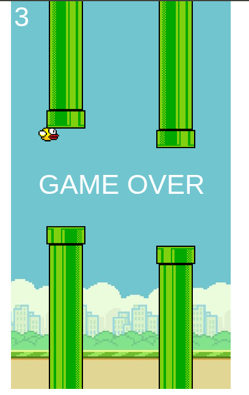
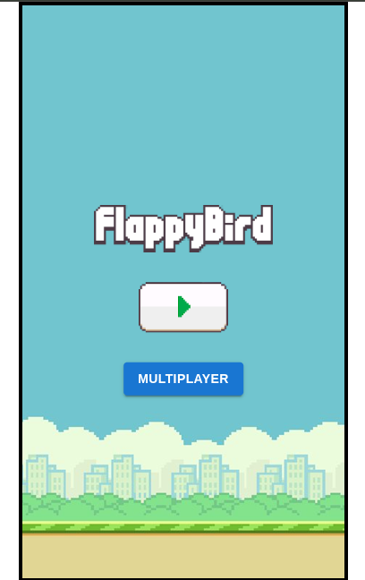
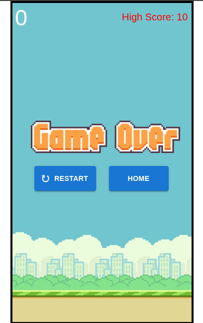
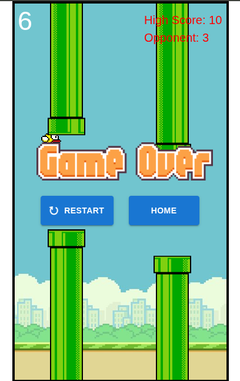
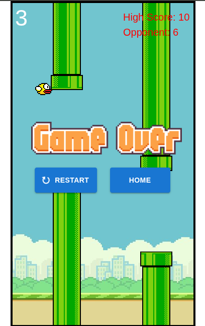
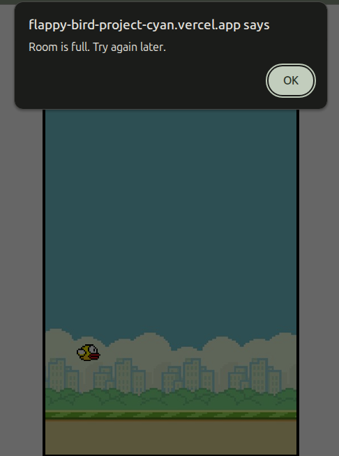

# 🐦 Flappy Bird Project

Welcome to the **Flappy Bird Project**, a dual-version web game demonstrating both fundamental and advanced web development skills. This project includes a **Basic version** built with HTML, CSS, and JavaScript, and a feature-rich **Multiplayer version** developed using React, Canvas, Socket.IO, and Material UI.

---

## 🚀 Live Demos

| Version         | Link                                                                 |
|----------------|----------------------------------------------------------------------|
| 🔹 Basic        | [Flappy Bird Basic](https://drushi248.github.io/Flappy-Bird-Project/Flappy_Basic/) |
| 🔸 Multiplayer  | [Flappy Bird Multiplayer](https://flappy-bird-project-cyan.vercel.app)         |

---

## 📁 Project Structure

```
Flappy-Bird-Project/
│
├── Flappy_Basic/                # Classic single-player version (HTML, CSS, JS)
│   ├── index.html
│   ├── style.css
│   ├── script.js
│   # Game assets: bird, pipes, backgrounds, etc.
│
├── Flappy_ultiplayer/         # Real-time multiplayer version
│   ├── client/                       # React + Canvas + MUI frontend
│   │   ├── Images/
│   │   ├── public/
│   │   ├── src/
│   │   │   ├── assets/
│   │   │   ├── App.css
│   │   │   ├── App.jsx
│   │   │   ├── Game.jsx
│   │   │   ├── Landing.jsx
│   │   │   ├── Multiplayer.jsx
│   │   │   ├── index.css
│   │   │   └── main.jsx
│   │   └── package.json
│   │
│   ├── server/                       # Node.js + Socket.IO backend
│   │   ├── index.js
│   │   └── package.json
│
└── README.md
```


---

## ✨ Features

### 🎮 Flappy Bird Basic
- Single-player gameplay using HTML, CSS, and JavaScript
- Gravity, flap, and pipe collision mechanics
- Score counter and best score tracking with `localStorage`
- Fully responsive with pixel-art styled assets

### 🧑‍🤝‍🧑 Flappy Bird Multiplayer
- Up to 2 players per room
- Real-time syncing of bird movement and scores using **Socket.IO**
- Room logic with automatic detection for full rooms
- Real-time score updates and live leaderboard
- Player connection and disconnection notifications
- Polished UI with **Material UI** and responsive canvas

---

## ⚙️ Tech Stack

| Layer      | Technologies                              |
|------------|-----------------------------------------|
| Frontend   | HTML, CSS, JavaScript (Basic)            |
|            | React, Canvas API, Material UI (Multiplayer) |
| Backend    | Node.js, Express, Socket.IO               |
| Deployment | Basic: GitHub                            |
|            | Multiplayer: Vercel (Frontend), Render (Backend) |


---

## 🧪 How to Run Locally

### 🔹 Basic Version
```bash
cd Flappy_Basic
# Open index.html in a browser
```
### 🔸 Multiplayer Version

## 1️⃣ Run the Server
```bash
cd Flappy_Multiplayer/server
npm install
node index.js
```
## 2️⃣ Start the Client
```bash
cd flappy-bird-multiplayer/client
npm install
npm start
```
✅ Make sure your server is running before starting the client to enable multiplayer communication.


## 📷 Screenshots

### 🔹 Basic Version


### 🔸 Multiplayer Version
<div style="display: flex; gap: 10px; flex-wrap: wrap;">
  
  
  
  
  
</div>


## 🎓 What I Learned
- Building games with core JavaScript and Canvas  
- Managing real-time game states with WebSockets  
- Structuring React applications with reusable components  
- Synchronizing multi-client state and handling latency  
- Deploying full-stack applications to Vercel and Render  
- Designing intuitive and responsive UI with Material UI


## 🎯 Why This Project Stands Out
- 📌 Covers both vanilla and modern web technologies  
- 🎯 Demonstrates complete full-stack development  
- 🌐 Supports real-time multiplayer gameplay  
- 💡 Great example of modular and scalable architecture


## 🔗 Connect with Me

If you're a fellow developer, I’d love to connect!

- [](https://www.linkedin.com/in/rushikesh-deshmukh-ad47/) 
- [](https://github.com/DRushi248)  
- [](mailto:rushi248tatya@gmail.com)  

⭐ If you liked this project, feel free to star the repo and share it!


